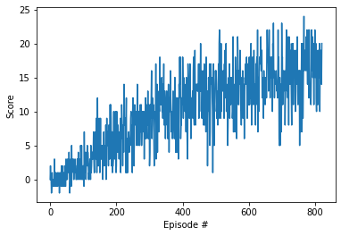

# Report

This report describes the Navigation project for Udacity Deep Reinforcement Learning Nanodegree

## Learning algorithm

DQN algorithm was used to solve this enviroment. Each state, action, reward, next state and info if episode is done is stored in replay buffer, from which they are sampled to be used in the learning process. In learning process algorithm compares the expected values of rewards calculated with weigths from local neural network with values calculated for next step with weights from target neural network.

## Hyperparameters

* BUFFER_SIZE = int(1e5) - how many steps are stored in buffer
* BATCH_SIZE = 64 - how many steps are batched in training the NN
* GAMMA = .99 - discount rate
* TAU = 1e-3 - rate at which target weights are updated
* LR = 5e-4 - learning rate for NN optimizer
* UPDATE_EVERY = 4 - how often update the NN
* n_episodes = 2000 - number of episodes after which learning stops
* max_t = 1000 - max steps in episode
* eps_start = 1.0 - starting epsilon for choosing policy
* eps_end = 0.01 - minimum value of epsilon
* eps_decay = 0.995 - rate at which epsilon decay

## Neural network

The neural network consists of two fully connected layers with 64 neurons each and relu activation and output layer with 4 neurons with relu activation.

## Score plot

The enviroment was solved in less then 600 episodes.

## Ideas for the future

In the future this project can be improved by applying Double DQN, Prioretized Experience Replay and Dueling DQN.
